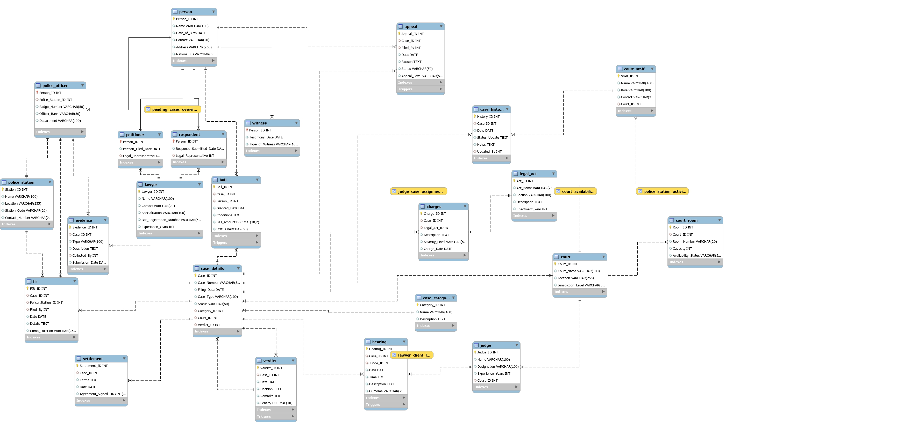

# Judicial Case Management Database System (JCDBS)

A comprehensive MySQL database system for managing court operations, case workflows, and judicial processes.

## 🎯 Overview

This project implements a complete database solution for judicial case management, designed to handle the entire lifecycle of legal cases from filing to verdict. It supports multiple court levels, tracks evidence and hearings, manages bail and appeals, and maintains complete audit trails.

## ✨ Features

- **Complete Case Lifecycle**: From filing → hearings → verdict → appeals
- **Multi-Level Court Support**: District, High, and Supreme Courts
- **Personnel Management**: Lawyers, judges, police officers, court staff, witnesses
- **Evidence & FIR Tracking**: Chain of custody for all evidence
- **Automated Workflows**: Triggers for status updates and audit logging
- **Stored Procedures**: Standardized operations for common tasks
- **Custom Functions**: Business logic for bail eligibility, workload calculations
- **Reporting Views**: Pre-built views for court clerks, administrators, and lawyers

## 🗄️ Database Schema

### Tables (23 Total)

| Category | Tables |
|----------|--------|
| **Master Data** | `Court`, `Case_Category`, `Legal_Act` |
| **People** | `Person`, `Lawyer`, `Judge`, `Police_Officer`, `Witness`, `Petitioner`, `Respondent` |
| **Case Management** | `Case_Details`, `Case_History`, `Verdict`, `Charges`, `Settlement`, `Appeal` |
| **Police Operations** | `Police_Station`, `FIR`, `Evidence` |
| **Court Operations** | `Hearing`, `Court_Room`, `Court_Staff` |
| **Legal Processes** | `Bail` |

### Key Design Patterns

- **Generalization**: `Person` serves as the base entity for all individuals
- **Audit Trail**: `Case_History` tracks all status changes automatically
- **Normalization**: Schema designed to 3NF (Third Normal Form)

## 📊 Sample Data

- **380+ Records** across all tables
- **20 Sample Cases** with complete workflows
- **50 Individuals** (petitioners, respondents, lawyers, judges, officers)
- **10 Legal Acts** for charge references

## 🚀 Getting Started

### Prerequisites

- MySQL 8.0 or higher
- MySQL client (CLI or Workbench)
- ~500MB disk space

### Installation

1. **Create the database:**
```sql
CREATE DATABASE judicialcasedb;
USE judicialcasedb;
```

2. **Execute scripts in order:**
```bash
mysql -u root -p judicialcasedb < "1. DBMSL Project - Tables.sql"
mysql -u root -p judicialcasedb < "2. DBMSL Project - Sample Data.sql"
mysql -u root -p judicialcasedb < "3. DBMSL Project - Queries.sql"
mysql -u root -p judicialcasedb < "4. DBMSL Project - Views.sql"
mysql -u root -p judicialcasedb < "5. DBMSL Project - Functions.sql"
mysql -u root -p judicialcasedb < "6. DBMSL Project - Procedures.sql"
mysql -u root -p judicialcasedb < "7. DBMSL Project - Triggers.sql"
```

Or execute them sequentially in MySQL Workbench.

## 📁 Project Structure

```
.
├── 1. DBMSL Project - Tables.sql      # DDL - Create all tables
├── 2. DBMSL Project - Sample Data.sql  # DML - Insert sample records
├── 3. DBMSL Project - Queries.sql      # DQL - Sample queries
├── 4. DBMSL Project - Views.sql        # Views for reporting
├── 5. DBMSL Project - Functions.sql     # Custom functions
├── 6. DBMSL Project - Procedures.sql   # Stored procedures
├── 7. DBMSL Project - Triggers.sql    # Automated triggers
├── er.pdf                             # ER Diagram
├── README.md                          # This file
└── JCDBS_Complete_Documentation.md   # Detailed documentation
```

## 🔧 Key Components

### Views
| View | Purpose |
|------|---------|
| `Pending_Cases_Overview` | Monitor pending cases for scheduling |
| `Lawyer_Client_List` | Track lawyer-client assignments |
| `Court_Availability` | Assign courtrooms for hearings |
| `Police_Station_Activity` | Assess station workloads |
| `Judge_Case_Assignments` | Review judge case loads |

### Stored Procedures
| Procedure | Purpose |
|-----------|---------|
| `Add_New_Hearing` | Schedule court hearings |
| `Finalize_Case` | Record verdict and close case |
| `Assign_Court_Staff` | Assign clerks to cases |
| `Update_Appeal_Status` | Update appeal outcomes |
| `Record_Settlement` | Log out-of-court settlements |

### Functions
| Function | Purpose |
|----------|---------|
| `Get_Judge_Experience` | Returns judge experience for a case |
| `Get_Lawyer_Case_Count` | Count active cases per lawyer |
| `Is_Bail_Eligible` | Check bail eligibility by charge severity |
| `Get_Court_Load` | Count active cases per court |
| `Get_Witness_Count` | Count witnesses for a case |

### Triggers
| Trigger | Purpose |
|---------|---------|
| `Update_Case_On_Hearing` | Auto-update case status to 'Ongoing' |
| `Log_Verdict_Update` | Audit trail for verdicts |
| `Restrict_Felony_Bail` | Prevent bail for felony charges |
| `Update_Room_On_Hearing` | Auto-occupy courtroom on hearing |
| `Log_Appeal_Update` | Track appeal progress |

## 💡 Usage Examples

### Schedule a New Hearing
```sql
CALL Add_New_Hearing(1, 1, '2025-05-01', '10:00:00', 'Bail review');
```

### Record a Verdict
```sql
CALL Finalize_Case(1, 21, 'Guilty', 5000.00);
```

### Check Court Workload
```sql
SELECT Court_Name, Get_Court_Load(Court_ID) AS Active_Cases FROM Court;
```

### View Pending Criminal Cases
```sql
SELECT * FROM Pending_Cases_Overview WHERE Category = 'Criminal';
```

## 📈 Sample Queries Included

1. **Pending Criminal Cases** - Filter cases by category and status
2. **Experienced Family Lawyers** - Find lawyers with 8+ years experience
3. **High Penalty Verdicts** - Cases with penalties over $6000
4. **Judge Workloads** - Judges handling multiple ongoing cases
5. **Station FIRs** - FIRs filed at specific police stations
6. **Hearing Schedules** - Cases scheduled by month
7. **Inspector Evidence** - Evidence collected by inspector-ranked officers
8. **Bail Grants** - Bail applications granted by date
9. **Expert Witnesses** - Expert testimonies by year
10. **High Court Appeals** - Granted appeals at high court level

## 📊 Class Diagram



The class diagram shows all 23 entities, their attributes, and relationships, generated via MySQL reverse engineering.

## 🎓 Academic Context

This project was developed as part of a **Database Management Systems (DBMS)** course assignment. It demonstrates:

- Database design and normalization
- SQL DDL, DML, DQL operations
- Advanced SQL features (views, functions, procedures, triggers)
- Real-world database application development

## 📝 Documentation

For complete technical documentation including:
- Detailed table schemas
- Complete data dictionary
- Foreign key relationships
- All SQL code with explanations
- Usage workflows

See: **[JCDBS_Complete_Documentation.md](./JCDBS_Complete_Documentation.md)**

##  Data Integrity Features

- **Primary Keys** on all tables
- **Foreign Key Constraints** for referential integrity
- **Unique Constraints** on court codes, case numbers, bar registration
- **Check Constraints** via triggers (e.g., felony bail restriction)
- **Audit Logging** via Case_History table

## 🛠️ Technologies

- **Database**: MySQL 8.0+
- **Schema Design**: Third Normal Form (3NF)
- **Sample Data**: 380+ records
- **Diagram**: Entity-Relationship Diagram (PDF)

---

## 📧 Contact

For questions or suggestions regarding this project, please open an issue on GitHub.

---

**Last Updated**: March 2026  
**Project Type**: Academic DBMS Project  
**License**: For educational purposes
